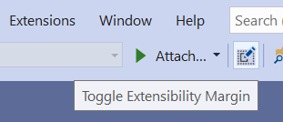
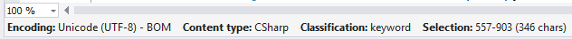
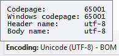
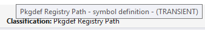

# Extensibility Margin

A collection of minor fixes and tweaks for Visual Studio to reduce the paper cuts and make you a happier developer

Download this extension from the [Marketplace](https://marketplace.visualstudio.com/items?itemName=MadsKristensen.ExtensibilityMargin)
or get the [CI build](https://www.vsixgallery.com/extension/41b4c077-6d9f-4e0a-a356-988baf3e830a).

-----------------------------------------

The margin is located below the bottom scrollbar and comes in handy when writing extensions that extends the VS editor.

# Toggle on/off
Toggle the margin visibility on/off from a new button on the Standard toolbar.

# Bottom margin

## Document encoding
Shows the encoding of the current document and more details on hover.

## Content type
Shows the content type of the ITextBuffer at the caret position. The over tooltip shows the name of the base content type.

## Classification
Displays the name of the classification at the caret position in the document. The hover tooltip shows the inheritance hierarchy of the EditorFormatDefinition's BaseDefinition attribute.

## Selection
Displays the start and end position of the editor selection as well as the total length of the selection.

## License
[Apache 2.0](LICENSE)