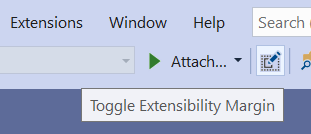
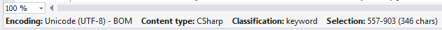
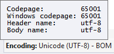
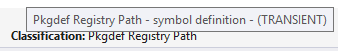

# Extensibility Margin

A focused utility for Visual Studio extension authors.

Extensibility Margin adds a live diagnostics strip below the editor so you can inspect editor state at the caret without writing temporary debug UI.

Download this extension from the [Marketplace](https://marketplace.visualstudio.com/items?itemName=MadsKristensen.ExtensibilityMargin)
or get the [CI build](https://www.vsixgallery.com/extension/41b4c077-6d9f-4e0a-a356-988baf3e830a).

-----------------------------------------
  
The margin is located below the bottom scrollbar and is designed for people building editor features.

## Why extension authors use it

- Validate `ITextBuffer` content types in real time
- Inspect classification names and inheritance while testing classifiers
- Check selection boundaries and lengths for command/filter logic
- Confirm file encoding details when working with text pipelines

If you work with MEF editor components, taggers, classifiers, or command handlers, this gives immediate feedback directly in the editor.

## Toggle on/off

Toggle the margin visibility on/off from a new button on the Standard toolbar.

## Bottom margin

### Document encoding

Shows the encoding of the current document and more details on hover.

### Content type

Shows the content type of the ITextBuffer at the caret position. The hover tooltip shows the name of the base content type.

Useful when troubleshooting content type mismatches in providers and listeners.

### Classification

Displays the name of the classification at the caret position in the document. The hover tooltip shows the inheritance hierarchy of the EditorFormatDefinition's BaseDefinition attribute.

### Selection

Displays the start and end position of the editor selection as well as the total length of the selection.

## Typical workflows

1. Move the caret through sample text while validating content type/classification behavior.
2. Hover margin items to inspect additional metadata.
3. Toggle the margin on/off from the Standard toolbar when not needed.

## Installation

Install from the [Marketplace](https://marketplace.visualstudio.com/items?itemName=MadsKristensen.ExtensibilityMargin) or use the latest [CI build](https://www.vsixgallery.com/extension/41b4c077-6d9f-4e0a-a356-988baf3e830a).

## License

[Apache 2.0](LICENSE)
